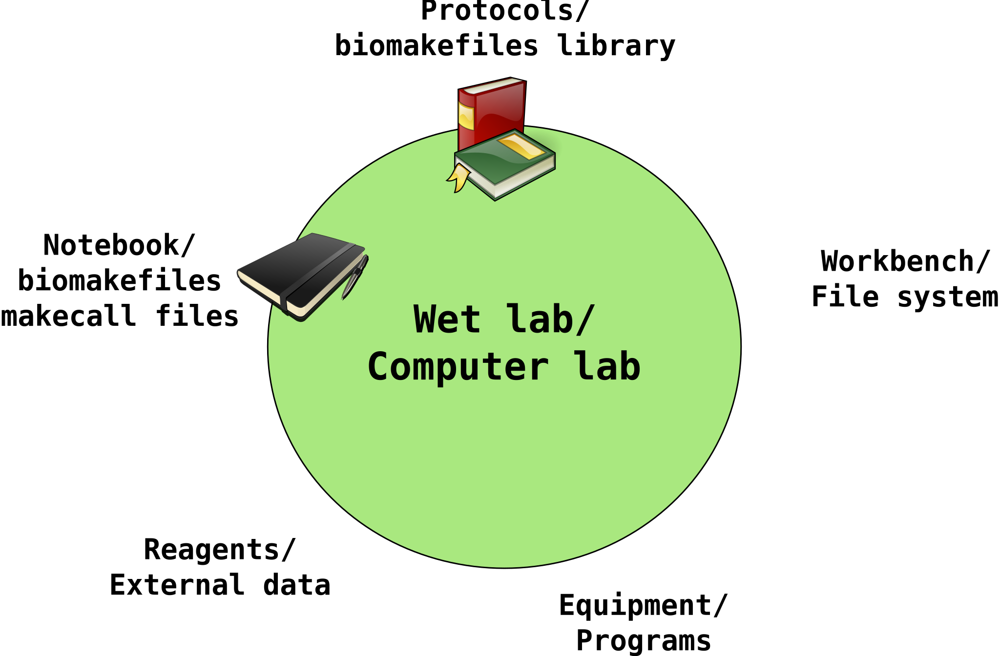

# biomakefiles

Library makefiles for various bioinformatic tools.

The library of makefiles in `lib/make` are meant for those who want to run common
bioinformatic tools a little bit easier with better documentation of which programs
were run, using which files etc., without commiting to a "pipeline".

# Overview -- wet lab analogy

The idea behind this is to set up a "lab" for computational analyses:



What is supplied by this repository is a collection of library makefiles, a book of
protocols that can be semi-automatically applied after some, typically simple, set up.
(Picture by myself. The small figures are all from Wikimedia commons, see
[doc/img/copyrights.txt](doc/img/copyrights.txt) for full copyrights.)

# Implementation

In `lib/make` there is a collection of makefiles that are supposed to be
included in a directory `Makefile`, making targets in the former available for
execution via make. In many cases there is also documentation in the `doc`
directory.

A typical `Makefile` in a user's directory can be as simple as this:

```make
include path/biomakefiles/lib/make/makefile.sickle
```

Given that the directory contains a number of pairs of fastq.gz files with
suffixes `.r1.fastq.gz` and `.r2.fastq.gz` respectively, all pairs can be
"sickled", i.e. trimmed, with the below command. Moreover, using make's simple
parallelization, eight pairs are sickled simultaneously.

```bash
make -j 8 fastq.gz2pesickle
```

As a side effect, how sickle was called -- program version, parameters, input
files -- is recorded in a file with a `.makecall` suffix.
