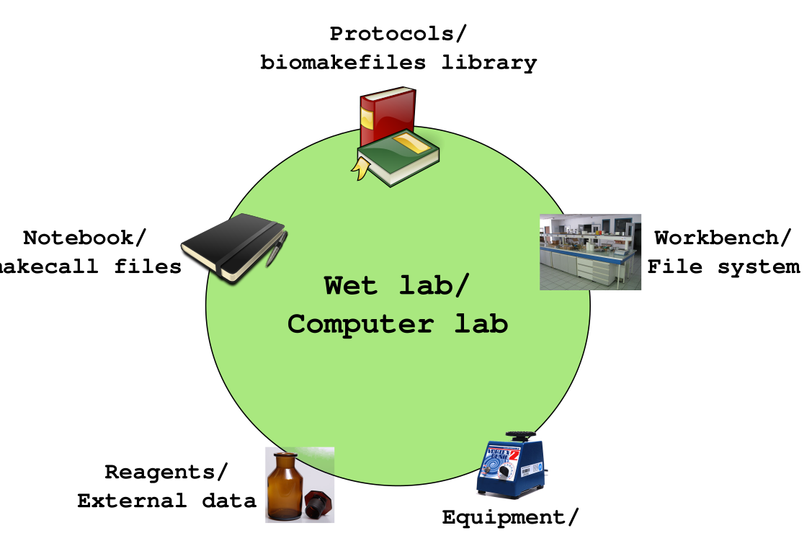

# biomakefiles

Library makefiles for various bioinformatic tools.

The library of makefiles in `lib/make` are meant for those who want to run common
bioinformatic tools a little bit easier with better documentation of which programs
were run, using which files etc., without commiting to a "pipeline".

# Overview -- wet lab analogy

The idea behind this is to set up a "lab" for computational analyses:



What is supplied by this repository is a collection of library makefiles, a book of
protocols that can be semi-automatically applied after some, typically simple, set up.
(Picture by myself. The small figures are all from Wikimedia commons, see
[doc/img/copyrights.txt](doc/img/copyrights.txt) for full copyrights.)

# Implementation

In `lib/make` there is a collection of makefiles that are supposed to be
included in a directory `Makefile`, making targets in the former available for
execution via make. In many cases there is also documentation in the `doc`
directory.

A typical `Makefile` in a user's directory can be as simple as this:

```make
include path/biomakefiles/lib/make/makefile.sickle
```

Given that the directory contains a number of pairs of fastq.gz files with
suffixes `.r1.fastq.gz` and `.r2.fastq.gz` respectively, all pairs can be
"sickled", i.e. trimmed, with the below command. Moreover, using make's simple
parallelization, eight pairs are sickled simultaneously.

```bash
make -j 8 fastq.gz2pesickle
```

As a side effect, how sickle was called -- program version, parameters, input
files -- is recorded in a file with a `.makecall` suffix.

# A word of caution

In short: Use `make -n` and run programs in dedicated directories.

Make will, in general, not make a file that is already made
(i.e. present in the file system) and newer than any of it's dependencies. It
also makes files recursively to make sure dependencies are in place. I
have, however, noticed that it sometimes gets confused. If you just run make
without checking, you might therefore start very time and resource consuming
steps again and *overwrite valuable files*.

To avoid this, make liberal use of make's `-n` flag that will tell you what make
will actually run if called with a specific target:

```bash
$ make -n target_name
```

Secondly, run programs in isolation by creating one directory for each step in
your process.

# Workflow

In many cases, setting up a processing step involves these individual steps:

1. Create a directory for the processing

2. Create a `Makefile` in the new directory. The `Makefile` typically mostly
   contains an `include` statement that includes one or (sometimes) more library
   makefiles from this repository. If the program is dependent on an external
   database, there is a make macro you should define to point to this data, see
   the library makefile in question. You might also want to add parameters to
   the program you will be running. Check the library makefile and program
   documentation.

3. Create symbolic links from files output by the last processing step in the
   new directory.

4. Find out the name of `all` target, i.e. the target that runs the program in
   question with all input files available in the directory (the symlinks
   created in the former step), and run. I recommend starting by running `make
   -n *target*` to check what *target* would do. After that run just `make` on
   its own, or parallelize with `make -j *n*`, where *n* is the number of
   parallel processes.

5. After all input files are processesed, make the statistics file for this
   directory (find out the name of the target in the library makefile) plus run
   `$ make stats.long.tsv` in the *root directory*.

 A more detailed instruction of this can be found in 
 [doc/new_process_step_with_screen_and_git.md](doc/new_process_step_with_screen_and_git.md).
