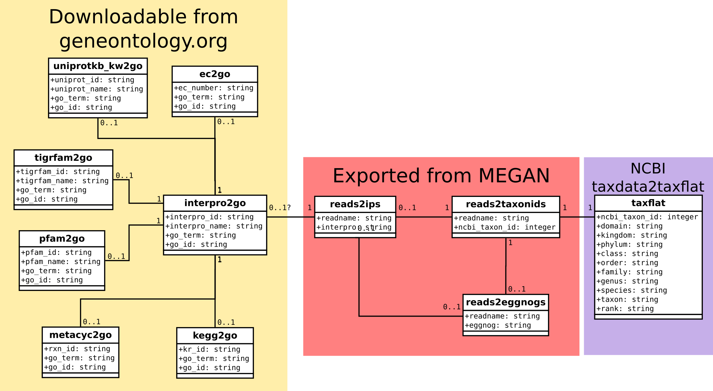

# Running Diamond/MEGAN

MEGAN is an annotation tool based on BLAST alignments to some database or
similar. 

It is thought to work on reads, which means it is quantitative directly. This
means BLAST is out of the question for any modern dataset, but an alternative
aligner, Diamond, has been developed by Benjamin Buchfink in collaboration with
the main author of MEGAN: Daniel Huson. Diamond is around five *orders of
magnitude* faster than BLAST, making it no big deal to align a couple of
flowcells worth of data to the NCBI RefSeq protein database.

MEGAN is a nice graphical application that allows nice visualizations as well as
some statistic tests both on the taxonomical composition of the data and a set
of different functional classifications: EggNOG, Interpro, GO. At the time of
writing I don't know about the status for the SEED classification.

(If one has assembled data, one can run Diamond/MEGAN, export the annotation,
add counts and reimport. Good if one wants one of the features of the graphical
interface, but not a nice hack.)

## Running Diamond

Diamond is, at the time of writing, a tool only for protein databases. It has a
blastx, as well as a blastp, mode though so one can align nucleotide sequences.

1) Download NCBI's RefSeq protein database

Target `mirror_refseq_protein.blast` in `biomakefiles/lib/mak/makefile.ncbidata`

```bash
$ make mirror_refseq_protein.blast
```

2) Convert to fasta format and the Diamond format

Targets in `biomakefiles/lib/mak/makefile.ncbidata` and
`/home/dl/dev/biomakefiles/lib/make/makefile.diamond`.

```bash
$ make refseq_protein.dmnd
```

3) Align

Targets in `biomakefiles/lib/make/makefile.diamond`

There doesn't seem to be a way of producing *one* meganized daa file from *two*
input daa files. It's therefore preferable to run Diamond on an interleaved
fastq file (can be gzipped) containing both reads from each pair. To interleave
sequences, look in the `makefile.misc` file. After you interleaved e.g. sickled
files, create symlinks in the directory from which you are going to run
Diamond:

```bash
$ mkdir read_oriented_analyses/diamond_megan
$ cd read_oriented_analyses/diamond_megan
$ ln -s ../../qc/*.pesickle.intlv.fastq.gz .
```

You *must* define the `DIAMOND_DB_PATH` macro to point to where the *Diamond
formated database* is (that's the directory where you ran steps 1 and 2). The
name of the database *must be* `refseq_protein.dmnd`. 

A `Makefile` will look something like this (assuming this directory is two
levels below the root, where you placed a symbolic link to the biomakefiles 
repository ([see setting up project directory](project_directory.md)):

```make
include ../../biomakefiles/lib/make/makefile.diamond

DIAMOND_DB_PATH = full_path_to_ncbi_data
```

To align a single fastq.gz file, `example.r1.fastq.gz`, to the NCBI RefSeq
protein database:

```bash
$ make example.pesickle.intlv.refseq_protein.daa
```

To run alignments of all fastq.gz files in the directory:

```bash
$ make fastq.gz2refseq_protein.daas
```

Diamond is a threaded application and will by default use all cpu cores it
finds. There is thus no need to use make's capabilities to parallelize this. If
you want to tweak cpu usage, e.g. because you're running other tasks, use the
`DIAMOND_ALIGN_OPTS` and set the Diamond `--threads=n` option in the `Makefile`
for that. E.g. (see assumption about directory structure above):

```make
include ../../biomakefiles/lib/make/makefile.diamond

DIAMOND_DB_PATH = full_path_to_ncbi_data
DIAMOND_ALIGN_OPTS = --threads 8
```

## Meganizing

After Diamond finishes, the .daa files produced can be "meganized", i.e.
analyzed by Megan to assign taxonomy, GO terms/InterPro ids, SEED subsystems
and COGs/EGGNOGs to reads. 

In `lib/make/makefile.megan` there are targets to run the meganizing process
from the command line. Since the name of meganized daa files remain the same,
the target for making each one has to depend on another suffix, in this case
`.meganize.out`. This file will contain quite a lot of progress output including
the statistics necessary for the summary statistics common to all steps.

To run `daa-meganizer`, as the meganizing program is called, add the below line
to your Makefile:

```make
include ../../biomakefiles/lib/make/makefile.megan
```

You will have to override the `MEGAN_INSTALL_DIR` macro if MEGAN is not
installed under `/usr/local/megan`. To find out if `daa-meganizer` is in its
expected place:

```bash
$ ls -l /usr/local/megan/tools/daa-meganizer
```

The above should not give a "File not found" error but show you an executable
file. If it didn't, MEGAN is installed somewhere else, perhaps in your home
directory or in `/opt/megan` and you need to set the `MEGAN_INSTALL_DIR`
accordingly.

You also need to point out where MEGAN's mapping files are. The default is a
directory called megan under the current directory. The simplest way of doing
that is to create a symlink to where you have stored the files. If you prefer
not to, you can override the `MEGAN_MAPS_DIR` macro.

Furthermore, four mapping files are expected: `prot_acc2tax.abin`,
`acc2eggnog.abin`, `acc2interpro.abin` and `acc2seed.abin`. Since MEGAN's
mapping files contain dates as a versioning system, you need to rename or,
preferrably, symlinks with the non-versioned names.

After you have specified everything, just run:

```bash
$ make -j N meganize_all
```

Where N is the number of processes. Meganizing requires quite a lot of memory,
so you can probably not run one process per cpu core. Depending on setup aim for
between a sixth and a quarter of the number of cpu cores.

After the meganizing is done, you can gather statistics the usual way:

```bash
$ make diamond-megan.stats.long.tsv
```

Remember to update the overall file in the root directory too
(`stats.long.tsv`).

### Data export

The annotations in the meganized daa files can be exported to text files for
further analysis in e.g. R. This can be done either as counts per annotation
entity, i.e. taxon, GO term or EGGNOG, or as a map from read names to annotation
entity. The former takes *much* less space, but the latter is more flexible.
With the latter you have the possibility to analyze e.g. the taxonomic
composition of a set of functional annotations, i.e. answering questions like
"Who are responsible for the increase of ribonucleotide reduction during
nutrient-rich conditions?". Since the size of output files for this information
is very large, you will probably want to export both formats.

Export is found in the menu system under `<File><Export>`. (There's also an
`<Export image>` option; that's for exporting the view you're looking at.
*Before* you export you need to make sure you have marked all the entities you
want to export, i.e. all taxa in the taxonomic view and all leaf nodes in the
functional views. To simply unfold the full tree and mark all nodes, you can
press `<Ctrl-L><Ctrl-Shift-U><Ctrl-A>` (select leaves, unfold full hierarchy and
select all). In the functional views you can end with `<Ctrl-L>` instead of
`<Ctrl-A>`. (Typically, you can't see that you have selected all leaves, because
there are too many. Just expand the view with the mouse wheel sufficiently and
it will be visible.) 

After you have selected all entitites to export, select `<File><Export><CSV
format...>` and you're presented with a menu where you can specify what to
export and which separator to use. At the top are the counts summaries, at the
bottom the read maps. Note that you're often given a choice between exporting
the annotation as a name or as a path. The latter means the hierarchy that is
presented in the MEGAN interface. Often, the path is difficult to handle in e.g.
R, since the number of levels is unspecified and varies within the same
annotation type. It can, however, also be quite useful but may require some
extra code in your R script.  For the *read maps* I suggest *only using the
name* since this will decrease their sizes. For summaries it might be good to do
both.

I export to subdirectories not to clutter the `diamond-megan` directory with so
many files. Typically I create subdirectory with the same name as the daa file,
minus the `.daa` plus a `.extractions.d`, e.g.
`Z905.erne-filter.standard.pandaseq.refseq_protein.extractions.d`. I name the
file with a suffix specifying what information is exported and in which format
(i.e. tsv), e.g.
`Z905.erne-filter.standard.pandaseq.refseq_protein.reads2eggnogs.tsv`.

Suffixes I use:

Export type | suffix
--- | ---
readName_to_eggnogName | `.reads2eggnogs.tsv`
readName_to_interpro2goNames | `.reads2ips.tsv`
readName_to_taxonId | `.reads2taxonids.tsv`

*Be careful* when you *use Git* so that you don't include very large files in the
repository. The `gitignores/diamond_megan.gitignore` will make sure you ignore
all daa, rma and tsv files, so copy that to `.gitignore` in the `diamond-megan`
directory.

*Gzip files* after export! In many cases the gzipped output can be used
directly.

(If you want an NCBI taxon hierarchy that is easier to work with, i.e. a table
with defined columns for ranked taxa, look in this repository:

https://github.com/erikrikarddaniel/taxdata2taxflat)

### Using exported data

The exported tab separated files can be used in e.g. R. In particular in
combination with other datasets, this is very powerful.



The above figure shows how the three types of tab separated files exported from
MEGAN can be joined together so that you can for instance find out the KEGG or
BioCyc reaction identifiers for proteins you're interested in.

In `lib/make/makefile.geneontology` there are rules to make tab separated files
from the files you can download from the geneontology.org site.

### Summarising over assignments

The above describes how to export the most flexible kind of data allowing full
use of the annotation. For many purposes, however, it's sufficient with
data summarized over functional or taxonomical names. This can be exported
directly from MEGAN, but if you prefer the command line, I have written an R
script (`summegan`) that does this. In addition to the (gzipped) tsv files, you
need a tab separated file with at least sample and type (DNA, RNA, aDNA etc.).
This *must* reside in the directory where you run the script and *must* be
called `metadata.tsv`.

The most practical way of running the program is to create a subdirectory to the
diamond/megan directory, create links to the tsv files (including the metadata)
and the R script. Assuming your diamond directory is two levels below the root
directory (where you have a symlink to a biomakefiles repository), that your
MEGAN tsv files are in a subdirectory called `megan_out` and your metadata file
is in `samples/metadata.tsv` under the root directory, you can do:

```bash
$ mkdir summaries
$ cd summaries
$ ln -s ../megan_out/*.tsv.gz .
$ ln -s ../../../samples/metadata.tsv .
$ ln -s ../../../biomakefiles/bin/summegan .
$ echo 'include ../../../biomakefiles/lib/make/makefile.summegan' > Makefile # Or use vim...
$ make all_sums # Can be parallelized, but doesn't take a lot of time and produced log messages
```

### Comparing

MEGAN provides several analysis possibilities. If you have several samples that
you want to create, you will like to create comparison datasets. This is done by
selecting <File><Compare> and selecting any open MEGAN datasets and adding
non-open datasets.

The comparison datasets only contain counts for taxa and functional assignments.
This means the files are *much* smaller than the daa files, but also that you
can't look into the taxonomic distribution of a functional classification. To
perform the latter you can go back to the daa file, select whichever nodes
you're intersted in -- functional or taxonomical -- and select <File><Extract to
new document>. Documents created this way will be in the MEGAN native format
having a `.rma6` suffix and will be large. You can use these files to do
comparisons.
